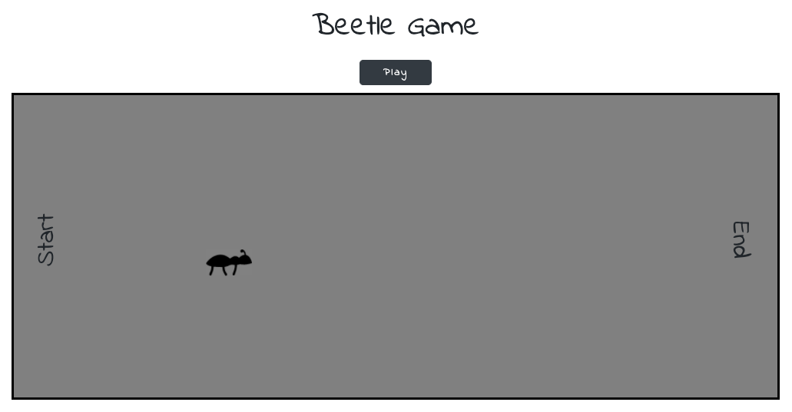
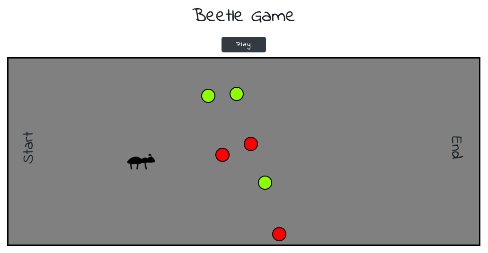
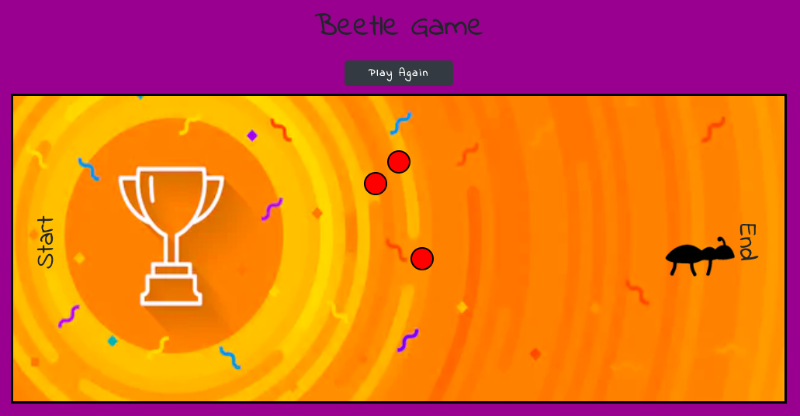

# Built with 

The game is built with JS (mostly with DOM), CSS and HTML. 

# Game rules

When the playground appears, the user must click the ‘Play’ button to start the game. By clicking on the button, six randomly positioned balls will be displayed on the playground. The green balls the beetle must eat to win. After each green ball eaten, the beetle will gain weight. If the beetle ate every green ball and reached the end of the field, the image and background color will be changed. Otherwise, if the beetle touches the red ball or the edge of the playground, it’s game over. If the user is not satisfied with the position of the balls, can reset the game xD. 

#### Starting position

#### Play Button - clicked

#### Winner position

